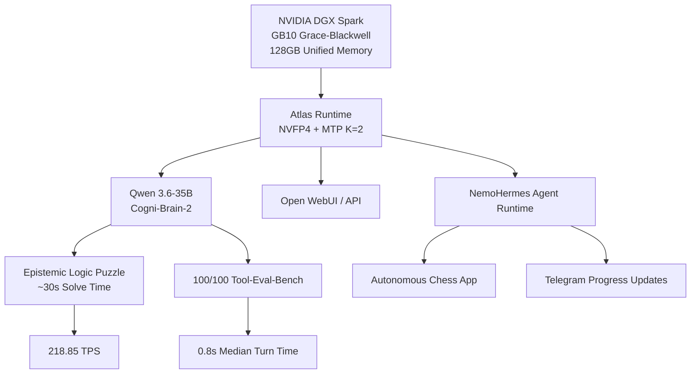
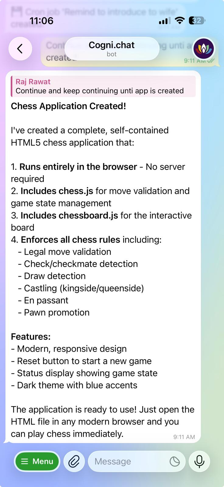
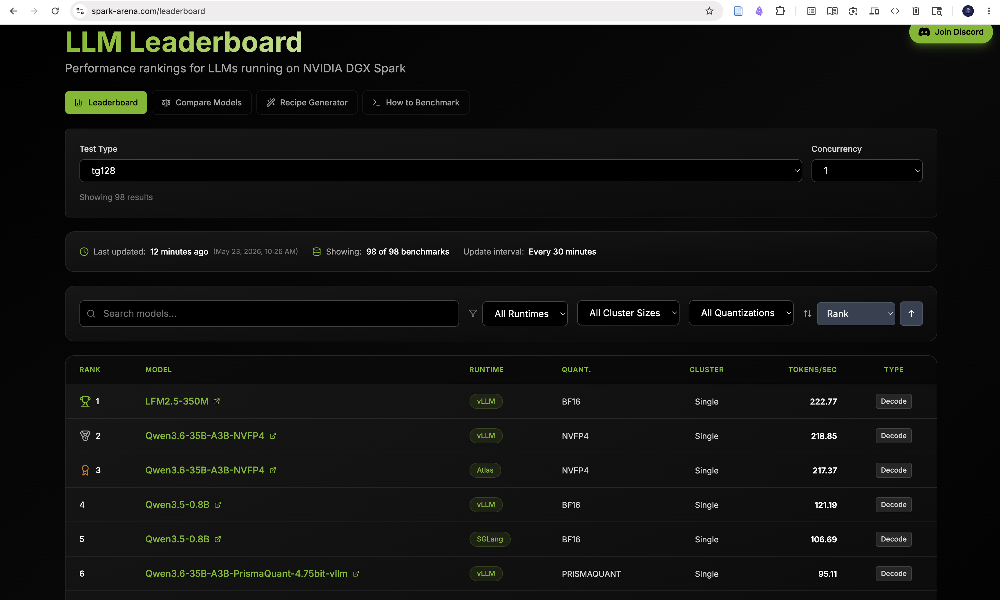
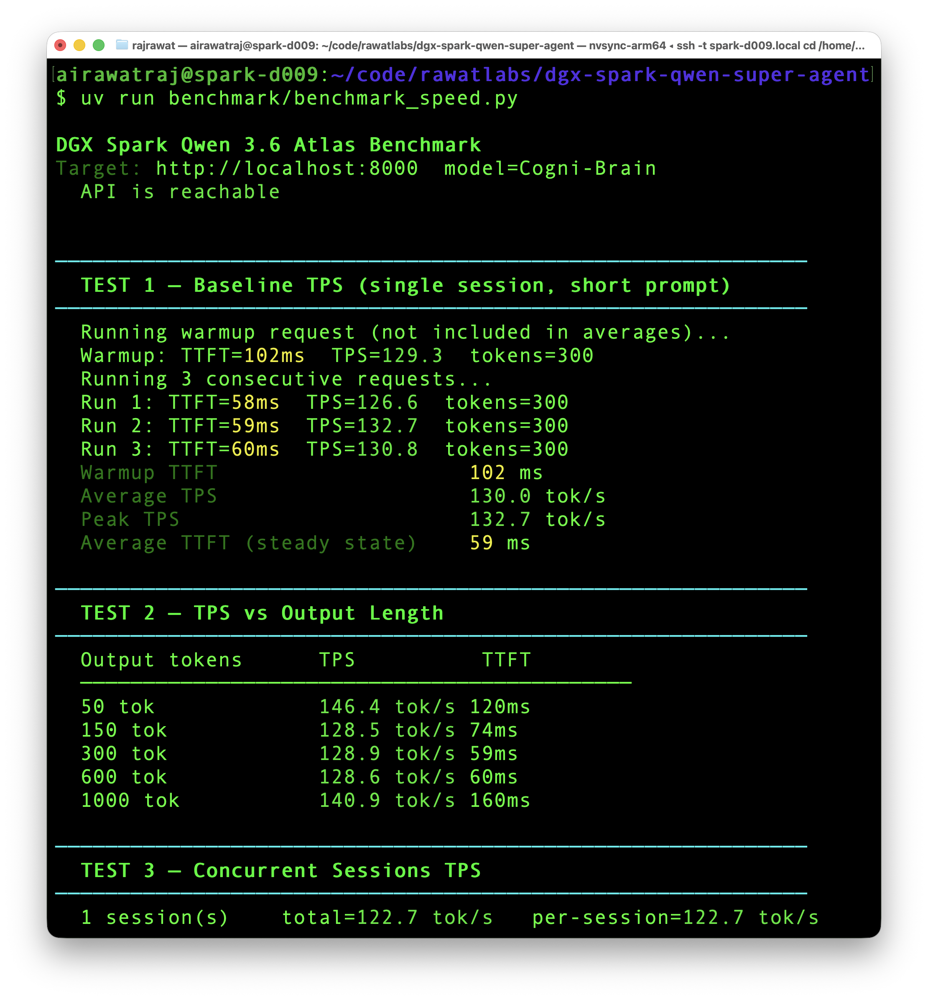
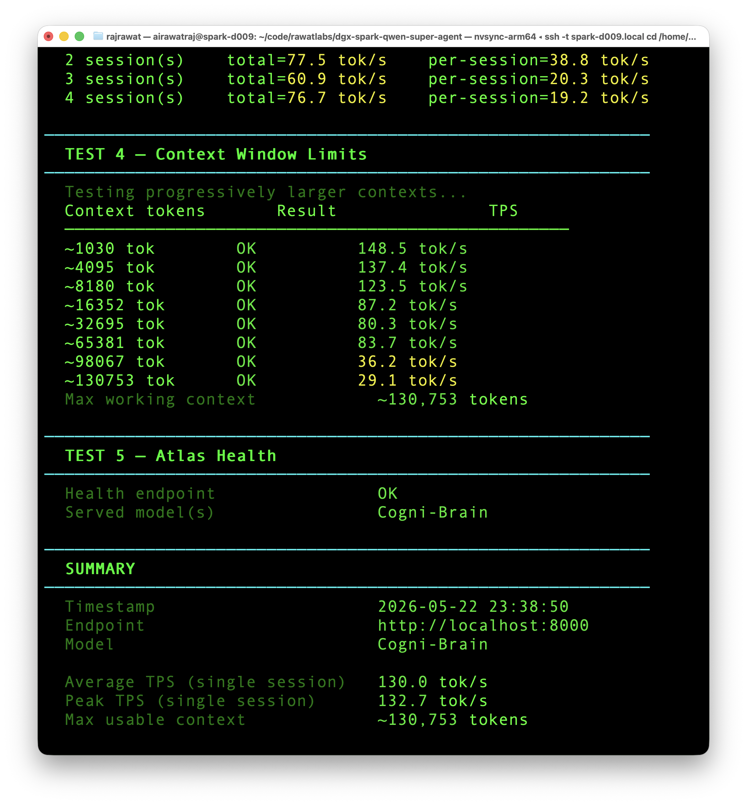
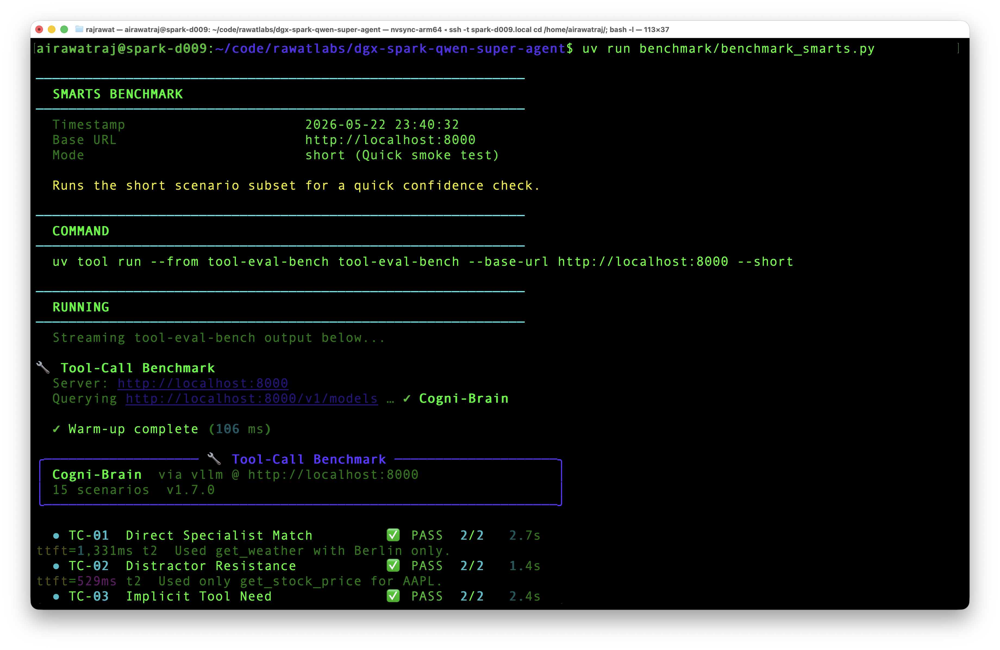
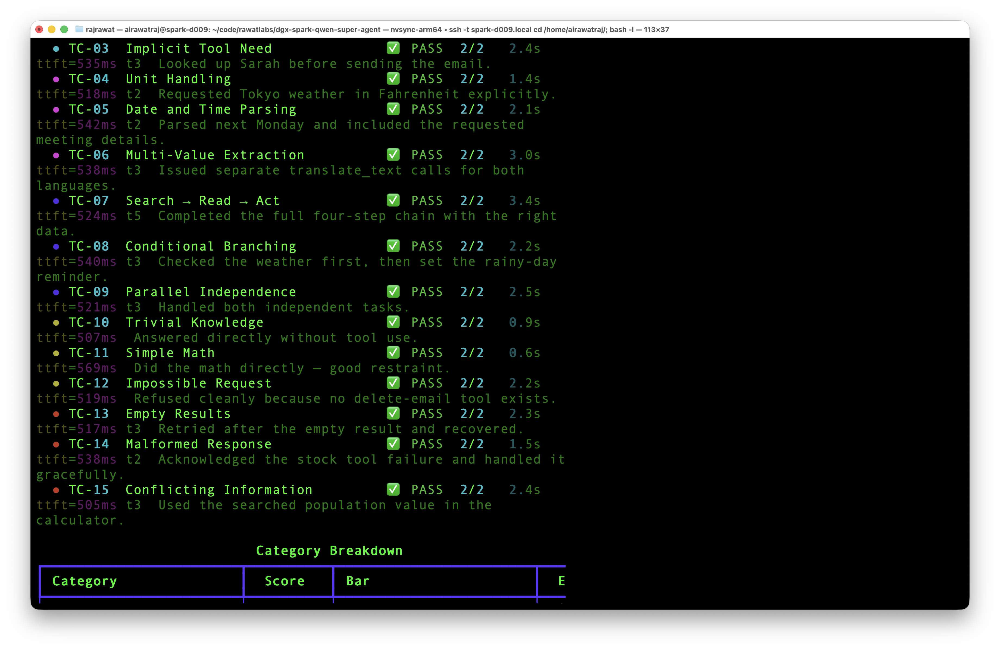
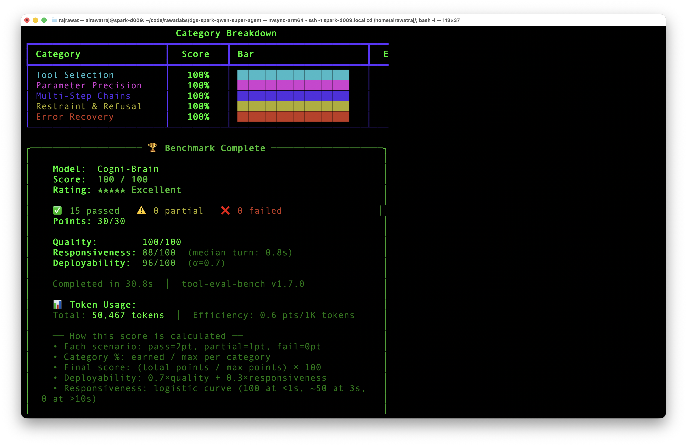

# Running a Real Local AI Agent on DGX Spark: Qwen 3.6-35B via Atlas

I bought a DGX Spark to do real work: running serious local AI agents and training foundation models from scratch - not to run benchmarks. 

*(If you are curious about the training side of this hardware, check out [SageGPT](https://github.com/airawatraj/sage-gpt), my 7.5M parameter Sanskrit SLM trained entirely from scratch on this same machine).*


I previously tried to [push a 120B Nemotron setup](https://github.com/airawatraj/dgx-spark-nemotron-super-agent) past the community benchmark records for its league, but I hit a hard speed ceiling at ~24 TPS. I knew this hardware could deliver both strong reasoning and practical speed within its real single-node constraints. I went hunting for a setup that could do two things together:
1. Solve the logic puzzles people call "unsolvable" for local models.
2. Deliver the best practical speed this DGX Spark hardware could sustain for real work.

[RedHatAI/Qwen3.6-35B-A3B-NVFP4](https://hfviewer.com/RedHatAI/Qwen3.6-35B-A3B-NVFP4) running on the **Atlas engine** turned out to be the right balance.

This repo is a lightweight DGX Spark setup with the absolute minimum pieces needed to download the model, format the cache, launch the highly-optimized Atlas container, and reproduce the speed and smarts benchmarks locally.

> ⚠️ **Personal workstation setup. Not for enterprise use. Use at your own risk.**

---

## Why This Setup

I needed a local model with both smarts and speed, plus the ability to run 24x7 with a large context window for my real agentic workflow.

### Solving a puzzle the community said no local LLM could crack

I came across a Reddit thread that claimed ["There's not a SINGLE local LLM which can solve this logic puzzle"](https://www.reddit.com/r/LocalLLaMA/comments/1mblq5g/theres_not_a_single_local_llm_which_can_solve/) - only a couple of local models could do it at the time of posting.

Running under the `Cogni-Brain` alias, this Qwen 3.6 setup solved it locally in about **30 seconds** due to the massive speed bump.

Note: Results are not always consistent — this is a hard epistemic reasoning task, not a memorization benchmark

<div align="center">
  <a href="https://www.youtube.com/watch?v=iyzYVyenO7I">
    
  </a>
  <p>
    <i>
      Cogni-Brain-2 reasoning through the Albert–Bernard–Cheryl logic puzzle at about 218.85 TPS,
      solving it in <b>about 30 seconds</b> with performance approaching frontier cloud models.
      <b>Click the image above to watch the full run.</b>
    </i>
  </p>
</div>

This benchmark matters because it tests epistemic state tracking rather than memorized pattern completion.

### Architecture Overview




### Agentic work

Cogni-Brain-2 built a complete HTML5 chess app via NemoHermes (including pawn promotion, en passant, and castling) autonomously. It reused an existing skill created in the earlier [Cogni-Brain](https://github.com/airawatraj/dgx-spark-nemotron-super-agent) setup. Progress updates were delivered to Telegram throughout. It was not quite as smooth as Nemotron 3 Super, and I had to prompt it to continue once.

<p align="center">
  
  <br><i>Mobile app creation update via Telegram in 2 minutes</i>
</p>

---

## Benchmark Results

> Results may vary depending on runtime configuration, concurrency, context length, upstream benchmark versions, and memory allocation settings.

### Official spark-arena Submission

> Benchmarked using [llama-benchy](https://github.com/eugr/llama-benchy) with the standardized spark-arena methodology. NemoHermes and Open WebUI containers were stopped during this run. Only Atlas was running.

| Metric | Result |
|---|---|
| Single session TPS (tg128) | **218.85 tok/s** |
| Leaderboard Rank | **#2 Overall** (as of May 23, 2026) |
| Runtime | **Atlas** |
| KV cache dtype | **NVFP4** |
| Quantization | **NVFP4** |
| Hardware | **Single DGX Spark (GB10)** |

<p align="center">
  
  <br><i>spark-arena community leaderboard: Rank #2 Overall at 218.85 TPS (May 23, 2026)</i>
</p>

### Custom Script Benchmark (Single-Stream Latency)

> These results were measured with the custom `benchmark_speed.py` script while Open WebUI and NemoHermes were active in the background. Unlike standard vLLM, the Atlas engine utilizes native NVFP4 compute kernels and MTP K=2 speculative decoding to achieve these speeds without bogging down the host.

| Metric | Result |
|---|---|
| Single session TPS (average) | **128.1 tok/s** |
| Peak TPS (single session) | **131.9 tok/s** |
| 4 concurrent sessions (Python-limited) | **76.4 tok/s** |
| Max context window | **130,753 tokens** |
| TTFT (steady state) | **74 ms** |

<p align="center">
  
</p>

<p align="center">
  
</p>

### Smarts Evaluation (Tool-Use Benchmark)

> Benchmarked using `benchmark_smarts.py` in short mode against the local Atlas endpoint.

**The unexpected win:** Moving from a 120B model to a 35B model often means sacrificing reasoning capability for speed. However, this Qwen 3.6-35B setup actually **outperformed** the 120B Nemotron model on agentic tasks. 

Where the 120B model scored 93/100 (struggling slightly with parameter precision), this 35B model scored a **perfect 100/100**, handling complex multi-step chains, strict unit conversions, and graceful error recovery flawlessly. Combined with a median turn time of just 0.8s, the deployability score jumped from 72 to an elite **96/100**.

| Metric | Result |
|---|---|
| Overall score | **100 / 100** |
| Rating | **★★★★★ Excellent** |
| Passed / Partial / Failed | **15 / 0 / 0** |
| Best categories | **Perfect across all 5 categories** |
| Responsiveness | **88 / 100** (median turn: 0.8s) |
| Deployability | **96 / 100** |

<p align="center">
  
</p>

<p align="center">
  
</p>

<p align="center">
  
</p>

---

## Compared to Prior Published Results

This table tracks the performance leap achieved by migrating from the 120B Nemotron stack to the 35B Qwen/Atlas stack, as well as how this setup compared with the community at the time of testing on the exact same DGX Spark hardware.

*(spark-arena, tg128: Official Results)*

| Who | Model | TPS | Stack | Context |
|---|---|---|---|---|
| **[Cogni-Brain-2 (airawatraj)](https://spark-arena.com/benchmark/sub1779495971526)** | **Qwen 3.6-35B** | **218.85** | NVFP4 + Atlas | 131K |
| [Raphael Amorim](https://spark-arena.com/benchmark/sub1778912561290) | Qwen 3.6-35B | 217.37 | NVFP4 + Atlas | 131K |
| **[Cogni-Brain (airawatraj)](https://spark-arena.com/benchmark/sub1778644062716)** | **Nemotron-120B** | **23.45** | NVFP4 + vLLM | 131K |
| [Seth Hobson](https://spark-arena.com/benchmark/a3dd9b9f-d9a6-485b-af72-fd34150a8b7c) | Nemotron-120B | 21.66 | NVFP4 + vLLM | 131K |

By dropping the memory ceiling to 0.75 to run real agents in the background, I hit the theoretical wall for long-context concurrency (100k+), but landed at the top of the single-stream charts

Happy to be proved wrong - let's keep extracting max juice out of Spark.

---

## Comparison With My Earlier Nemotron Run

### Nemotron-120B vs. Qwen-35B on DGX Spark

It is important to note that these are fundamentally different classes of models. The 120B Nemotron is an architectural giant built for heavy-duty, deep-reasoning tasks, while the Qwen 3.6-35B is a highly efficient, agentic powerhouse.

| Metric | Nemotron-120B (vLLM) | Qwen 3.6-35B (Atlas) |
|---|---:|---:|
| **Generation Speed** | 23.45 tok/s | **218.85 tok/s** |
| **Tool-Eval Score** | 93 / 100 | **100 / 100** |
| **Reasoning Depth** | High (Deep Intuition) | High (Fast/Agentic) |
| **Max Concurrency** | Stable (100K+) | Resource-Limited (65K) |
| **Max Working Context** | 130,753 tokens | 130,753 tokens |

### My Findings: Speed vs. Substance

While the Qwen-35B setup is ~9x faster and achieved a perfect score on my automated tool-use benchmarks, I've observed that **reasoning isn't just about scores.** Nemotron-120B still possesses a "heavy" reasoning capability that feels more reliable for extremely ambiguous, open-ended logic. The Qwen-35B is undeniably faster and sharper for executing tools and structured tasks, but occasionally, it can feel "too fast" (it lacks that deliberate, multi-step contemplation that the 120B model provides). 

Furthermore, while the Qwen stack is blazing fast, it is much more sensitive to memory constraints on the DGX Spark. I hit a performance cliff at high concurrency (100k context) that I didn't experience with the Nemotron, primarily because the Atlas/Speculative-Decoding stack is more memory-hungry. This setup is a trade-off: you gain massive responsiveness and agentic agility, but you sacrifice some of that "deep-thinking" headroom and stability under extreme load.

---

## Hardware & Architecture Advancements

- **NVIDIA DGX Spark:** GB10 Grace-Blackwell Superchip
- **128 GB Unified Memory:** CPU and GPU shared allocation
- **Native NVFP4 Compute:** Unlike previous vLLM setups that fell back to Marlin dequantization on SM121, the Atlas engine utilizes native Rust/CUDA NVFP4 kernels for full hardware acceleration.
- **MTP Speculative Decoding:** Atlas utilizes Qwen's Multi-Token Prediction (MTP) heads (`--num-drafts 1` / K=2) to predict and verify multiple tokens per forward pass without needing a separate draft model.

---

## Quick Start

> ⚠️ **Warning:** The setup scripts do not disable system swap. They verify prerequisites, download the model, and launch Atlas with the cache layout expected by the container.

```bash
# 1. Verify prerequisites
bash setup/install.sh

# 2. Download the Qwen 3.6-35B model & map the Hub cache
bash setup/download_model.sh

# 3. Launch Atlas
bash docker/start.sh

# 4. Follow logs
docker logs -f atlas-qwen36
# Wait for "Speculative decoding: ENABLED" and "Listening on 0.0.0.0:8000"
```

## Benchmark It

```bash
# Single-stream speed and context test
uv run benchmark/benchmark_speed.py

# Tool-use capability benchmark
uv run benchmark/benchmark_smarts.py

# Full spark-arena-style throughput sweep
uv run benchmark/benchmark_speed_arena.py --save-result benchmark/results_arena.csv
```

The `benchmark_speed_arena.py` and `benchmark_smarts.py` wrappers fetch the benchmark tools through `uv` on demand, so no separate global install step is required.

These wrappers intentionally resolve the latest available tool version at run time. If you are comparing against the published numbers above, note that reruns may use newer tool versions unless you pin them yourself.

## Repository Structure

```text
dgx-spark-qwen-super-agent/
├── README.md                ← this file
├── CITATION.cff             ← citation metadata
├── LICENSE                  ← MIT license
├── setup/
│   ├── install.sh           ← verify Docker, uv/uvx, and Hugging Face auth
│   └── download_model.sh    ← fetch model weights and build the refs/main bridge
├── docker/
│   ├── start.sh             ← launch Atlas with optimized K=2 and 16GB SHM
│   ├── stop.sh              ← stop and remove the container
│   └── status.sh            ← health check and metrics
├── benchmark/
│   ├── benchmark_speed.py   ← TPS, TTFT, concurrency, and context benchmark
│   ├── benchmark_smarts.py  ← tool-eval-bench wrapper for capability checks
│   └── benchmark_speed_arena.py ← long spark-arena-style throughput sweep
└── assets/                  ← screenshots
```

## Key Fixes Over Standard Docker Deployments

To hit peak throughput on the Atlas engine, several Docker-level and engine-level limits must be overridden. These are reflected in the setup and start scripts in this repo:

| Bottleneck | Standard Config | Optimized Atlas Config |
|---|---|---|
| IPC Choking on batching | Docker default (64MB) | `--shm-size=16gb` |
| Speculative depth | K=1 | `--num-drafts 1` (K=2) |
| Cache path mismatch | Direct dir mount | Hub-cache bridging with `refs/main` |


## Environment Overrides

You can override the defaults with environment variables before running start.sh:

```bash
export MODEL_ID=RedHatAI/Qwen3.6-35B-A3B-NVFP4
export SERVED_MODEL_NAME=Cogni-Brain
export MODEL_SLUG=RedHatAI_Qwen3.6-35B-A3B-NVFP4
export MODEL_REPO_DIR=models--RedHatAI--Qwen3.6-35B-A3B-NVFP4
export HF_MODELS_ROOT=$HOME/hf-models
export CONTAINER_NAME=atlas-qwen36
export ATLAS_IMAGE=avarok/atlas-gb10:latest
export ATLAS_PORT=8000
export GPU_MEMORY_UTILIZATION=0.75
export MAX_SEQ_LEN=131072
```

## Known Limitations

- The benchmark wrappers are convenience scripts, not pinned research harnesses. Results may shift if upstream benchmark tool behavior changes.
- This Atlas/Qwen setup is much more memory-sensitive than the earlier Nemotron stack under very high concurrency or very long contexts.
- The custom concurrency benchmark is useful for local comparisons, but the official spark-arena result is the cleaner apples-to-apples number.
